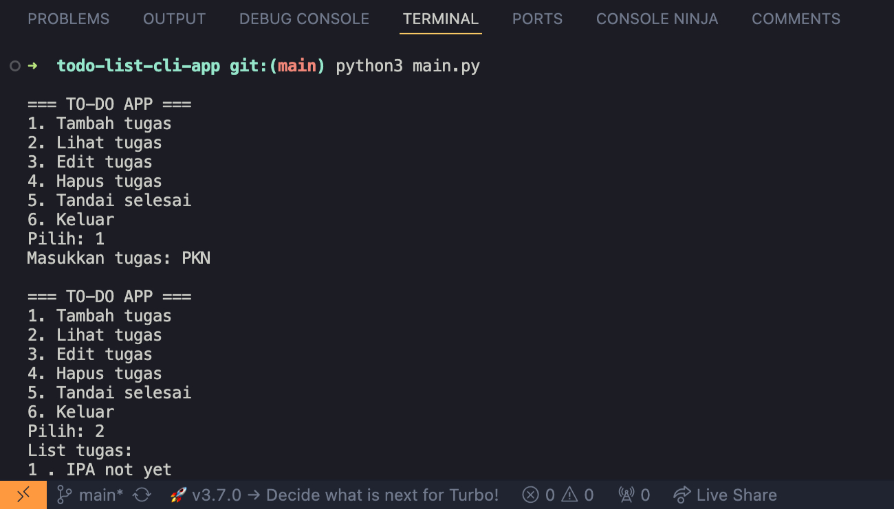
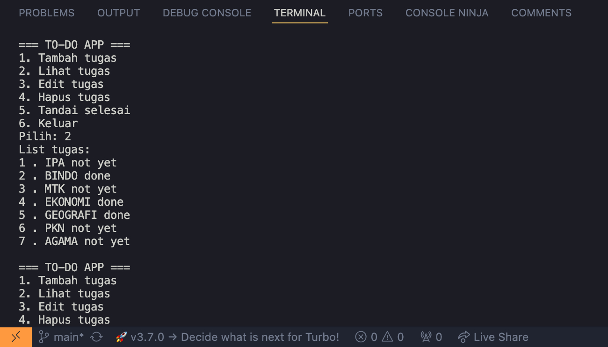
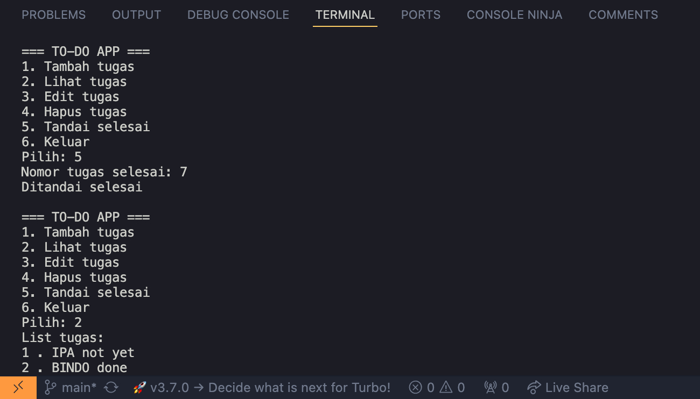

# 📝 To-Do List CLI App
Aplikasi manajemen tugas berbasis Command Line Interface (CLI) menggunakan Python/Python3.

## 🚀 Fitur
- Tambah tugas
- Lihat daftar tugas
- Edit tugas
- Hapus tugas
- Tandai tugas selesai
- Penyimpanan data menggunakan JSON

## 🛠️ Tech Stack
- Python/Python3
- JSON (untuk penyimpanan data)

## ▶️ Cara Menjalankan
1. Clone repository
2. Jalankan perintah:
   ```bash
   python/python3 main.py

## 📚 Apa yang Dipelajari
- Logika CRUD
- Struktur Data Python (list & dictionary)
- File handling
- Error handling
- Clean code dengan functions

## Screenshot Program




## 👨‍💻 Author
GitHub: @andarass